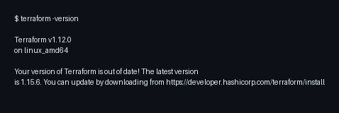
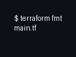
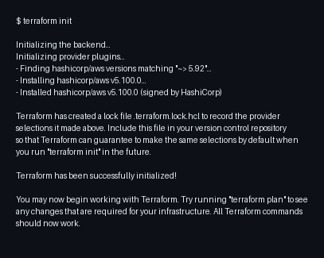
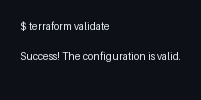
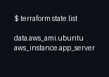
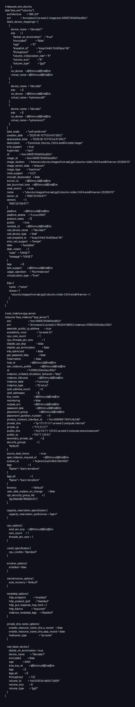
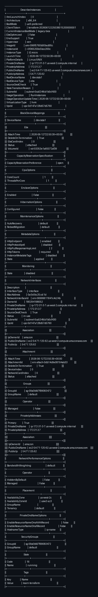

# Terraform AWS EC2 Tutorial - Infraestrutura como Código

Este repositório documenta a minha jornada seguindo o tutorial oficial da HashiCorp para criar infraestrutura na AWS utilizando Terraform. A ideia era colocar em prática os conceitos de Infraestrutura como Código (IaC) provisionando uma instância EC2 com Ubuntu 24.04 na região us-west-2.

## Sobre o projeto

O objetivo principal era aprender na prática como usar o Terraform para gerenciar recursos na nuvem. O projeto provisiona uma instância EC2 do tipo t2.micro (que se enquadra no AWS Free Tier) utilizando uma AMI do Ubuntu 24.04. Tudo isso é feito através de arquivos de configuração, sem precisar clicar manualmente na console da AWS.

## O que você precisa para reproduzir

- Terraform CLI (versão 1.2.0 ou superior)
- AWS CLI instalado
- Uma conta AWS com credenciais configuradas
- Permissão para criar recursos na região us-west-2

## Como o projeto está organizado

```
learn-terraform-aws/
├── terraform.tf      # Configura o Terraform e define o provider AWS
├── main.tf           # Declara a infraestrutura: provider, data source e recurso
├── .gitignore        # Evita que credenciais e arquivos sensíveis vão para o Git
├── screenshots/      # Prints dos comandos executados e recursos na AWS
└── README.md         # Este arquivo com toda a documentação
```

---

## Passo a passo do que foi feito

### 1. Criando o diretório do projeto

Primeiro, criei um diretório dedicado para organizar os arquivos de configuração do Terraform:

```bash
mkdir learn-terraform-aws
cd learn-terraform-aws
```

Isso ajuda a manter o projeto isolado e organizado, facilitando o versionamento e a manutenção.

---

### 2. Configurando o Terraform (arquivo terraform.tf)

Criei o arquivo `terraform.tf` para definir qual provider seria utilizado e garantir que as versões fossem controladas:

```hcl
terraform {
  required_providers {
    aws = {
      source  = "hashicorp/aws"
      version = "~> 5.92"
    }
  }

  required_version = ">= 1.2"
}
```

Aqui estou dizendo ao Terraform que vou usar o provider da AWS, mantido pela HashiCorp, e fixando a versão para evitar surpresas futuras. A notação `~> 5.92` significa que aceito versões a partir de 5.92, mas menores que 6.0, garantindo compatibilidade.

---

### 3. Escrevendo a infraestrutura (arquivo main.tf)

Este é o arquivo principal onde declarei toda a infraestrutura:

```hcl
provider "aws" {
  region = "us-west-2"
}

data "aws_ami" "ubuntu" {
  most_recent = true

  filter {
    name   = "name"
    values = ["ubuntu/images/hvm-ssd-gp3/ubuntu-noble-24.04-amd64-server-*"]
  }

  owners = ["099720109477"] # Canonical
}

resource "aws_instance" "app_server" {
  ami           = data.aws_ami.ubuntu.id
  instance_type = "t2.micro"

  tags = {
    Name = "learn-terraform"
  }
}
```

**O que cada bloco faz:**

- **Provider**: Informa ao Terraform que vou trabalhar na região us-west-2 (Oregon). O provider é o plugin que permite o Terraform conversar com a API da AWS.

- **Data Source**: Em vez de colocar o ID da AMI hardcoded no código (o que poderia ficar desatualizado), usei um data source para buscar dinamicamente a AMI mais recente do Ubuntu 24.04. Isso torna a configuração mais flexível e fácil de manter.

- **Resource**: Aqui é onde realmente defino a instância EC2. Escolhi o tipo t2.micro, que é elegível para o Free Tier da AWS, e adicionei uma tag chamada "learn-terraform" para identificar facilmente o recurso na console.

---

### 4. Verificando a versão do Terraform

```bash
terraform -version
```



O comando confirmou que o Terraform v1.12.0 estava instalado e pronto para uso.

---

### 5. Formatando o código

Antes de prosseguir, executei o comando de formatação para garantir que o código estava padronizado:

```bash
terraform fmt
```



O Terraform formatou o arquivo `main.tf` automaticamente, aplicando as convenções de estilo recomendadas pela HashiCorp. Isso ajuda a manter a legibilidade do código.

---

### 6. Inicializando o workspace

Com os arquivos criados, o próximo passo foi inicializar o workspace:

```bash
terraform init
```



Durante a inicialização, o Terraform baixou o provider da AWS e instalou na pasta `.terraform`. Também criou o arquivo `.terraform.lock.hcl`, que funciona como um "package-lock" do npm, garantindo que sempre que alguém clonar o repositório e rodar `terraform init`, as mesmas versões dos providers serão instaladas.

---

### 7. Validando a configuração

Antes de aplicar qualquer mudança na nuvem, validei a configuração para garantir que não havia erros de sintaxe:

```bash
terraform validate
```



A validação verifica se a sintaxe está correta, se todos os recursos referenciados existem, e se a configuração é internamente consistente. É uma boa prática executar isso antes de qualquer `apply`.

---

### 8. Criando a infraestrutura na AWS

Finalmente, chegou o momento de provisionar a instância EC2:

```bash
terraform apply -auto-approve
```


O Terraform primeiro gerou um plano de execução mostrando exatamente o que seria criado. O sinal de mais (+) indica que o recurso será criado. Depois de mostrar o plano, ele começou a criar a instância, mostrando o progresso em tempo real. Em cerca de 35 segundos, a instância estava pronta e rodando na AWS.

---

### 9. Verificando o que foi criado

Para confirmar que tudo deu certo, liste os recursos gerenciados pelo Terraform:

```bash
terraform state list
```



O Terraform mantém um registro de tudo que ele gerencia no arquivo `terraform.tfstate`. Mesmo o data source (que não é um recurso real na AWS) é rastreado, porque a AMI encontrada pode ser relevante para auditoria.

Para ver todos os detalhes da infraestrutura:

```bash
terraform show
```



O comando exibiu todas as informações da instância criada, incluindo o ID, tipo, zona de disponibilidade, IPs, security groups e muito mais.

---

### 10. Verificando o estado atual

Após a criação, executei o `terraform plan` para confirmar que a infraestrutura real está alinhada com a configuração:

```bash
terraform plan
```


O resultado "No changes" confirma que a instância EC2 foi criada exatamente conforme especificado nos arquivos de configuração.

---

## Recursos que foram provisionados na nuvem

Abaixo está um resumo detalhado de tudo que o Terraform criou na AWS, evidenciado por meio de comandos do AWS CLI.

### Instância EC2

| Atributo | Valor |
|----------|-------|
| Instance ID | i-0f365259e5bcc200c |
| AMI | ami-096f5760b00bcd95c (Ubuntu 24.04 Noble) |
| Instance Type | t2.micro |
| Region | us-west-2 (Oregon) |
| Availability Zone | us-west-2c |
| Estado | running |
| Public IP | 54.71.125.62 |
| Private IP | 172.31.3.7 |
| Public DNS | ec2-54-71-125-62.us-west-2.compute.amazonaws.com |
| Subnet ID | subnet-0ca534fcb1b0cf430 |
| Security Group | sg-09a0bfd7f99083472 |
| Network Interface | eni-06999611841c4c24b |
| Volume Root | vol-03353e1a65072af39 (8GB gp3) |
| Tag Name | learn-terraform |

### AMI utilizada

| Atributo | Valor |
|----------|-------|
| AMI ID | ami-096f5760b00bcd95c |
| Nome | ubuntu/images/hvm-ssd-gp3/ubuntu-noble-24.04-amd64-server-20260610 |
| Arquitetura | x86_64 |
| Virtualização | HVM |
| Owner | Canonical (099720109477) |
| Plataforma | Linux/UNIX |

### Evidência via AWS CLI

Para comprovar que os recursos realmente existem na AWS, executei o comando `aws ec2 describe-instances`:

```bash
aws ec2 describe-instances --region us-west-2 --instance-ids i-0f365259e5bcc200c
```



O output confirma que a instância está em execução, com todos os atributos que o Terraform provisionou: AMI, tipo t2.micro, IP público, DNS, security groups, volumes e outras configurações.

---

## Comandos úteis para o dia a dia

```bash
# Inicializar o projeto (rode primeiro sempre que clonar)
terraform init

# Validar a configuração
terraform validate

# Ver o plano de execução sem aplicar
terraform plan

# Aplicar as mudanças (com confirmação interativa)
terraform apply

# Aplicar sem precisar confirmar
terraform apply -auto-approve

# Destruir toda a infraestrutura
terraform destroy

# Listar recursos gerenciados
terraform state list

# Ver detalhes do estado
terraform show

# Formatar os arquivos
terraform fmt
```

---

## Considerações importantes

**Custo:** A instância t2.micro é elegível para o AWS Free Tier, que oferece 750 horas por mês gratuitas. Mesmo assim, é bom ficar atento ao uso e lembrar de destruir a infraestrutura quando não precisar mais.

**Segurança:** O arquivo `terraform.tfstate` contém informações detalhadas sobre a infraestrutura e pode incluir dados sensíveis. Nunca commite este arquivo diretamente em repositórios públicos sem cuidado. No meu caso, adicionei ao `.gitignore` para evitar que suba acidentalmente.

**Credenciais:** As credenciais da AWS estão configuradas localmente em `~/.aws/credentials`, fora do repositório do projeto. Isso é uma prática de segurança essencial para não expor chaves de acesso.

**Destruição:** Quando você não precisar mais da infraestrutura, execute `terraform destroy` para remover todos os recursos provisionados e evitar cobranças inesperadas.

---

## Referências

- [Tutorial Oficial HashiCorp - Create Infrastructure](https://developer.hashicorp.com/terraform/tutorials/aws-get-started/aws-build)
- [Documentação do Terraform AWS Provider](https://registry.terraform.io/providers/hashicorp/aws/latest/docs)
- [AWS Free Tier](https://aws.amazon.com/free/)
- [Linguagem HCL do Terraform](https://developer.hashicorp.com/terraform/language)

---

## Sobre este trabalho

Este projeto foi desenvolvido como parte do aprendizado prático de Terraform e Infraestrutura como Código. Cada etapa foi executada, documentada e validada, com prints dos resultados obtidos para garantir a rastreabilidade do processo.

**Repositório:** https://github.com/lucasbrasil9/terraform-aws-ec2-tutorial
