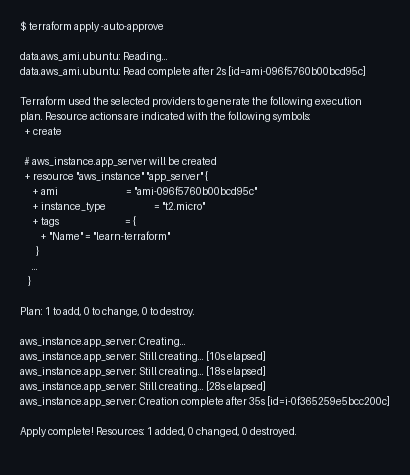
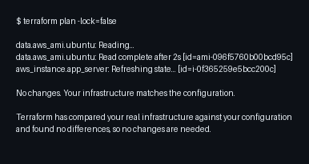

# Terraform AWS EC2 - Infraestrutura como Código

Este projeto implementa o tutorial oficial da HashiCorp para criar infraestrutura na AWS utilizando Terraform. Foi criado um diretório, configurados os arquivos .tf, e provisionada uma instância EC2 com Ubuntu 24.04 na região us-west-2.

## Pré-requisitos

- Terraform CLI 1.2.0+
- AWS CLI instalado
- Conta AWS com credenciais na região us-west-2

## Estrutura do Projeto

```
learn-terraform-aws/
├── terraform.tf      # Configuração do provider AWS
├── main.tf           # Infraestrutura: provider, data source e recurso EC2
├── .gitignore        # Protege arquivos sensíveis
└── screenshots/      # Prints dos comandos e da AWS Console
```

---

## Passo a Passo

### 1. Criando o projeto

```bash
mkdir learn-terraform-aws
cd learn-terraform-aws
```

### 2. Arquivos de configuração

**terraform.tf** - Define o provider e versionamento:

```hcl
terraform {
  required_providers {
    aws = {
      source  = "hashicorp/aws"
      version = "~> 5.92"
    }
  }
  required_version = ">= 1.2"
}
```

**main.tf** - Declara a infraestrutura:

```hcl
provider "aws" {
  region = "us-west-2"
}

data "aws_ami" "ubuntu" {
  most_recent = true
  filter {
    name   = "name"
    values = ["ubuntu/images/hvm-ssd-gp3/ubuntu-noble-24.04-amd64-server-*"]
  }
  owners = ["099720109477"] # Canonical
}

resource "aws_instance" "app_server" {
  ami           = data.aws_ami.ubuntu.id
  instance_type = "t2.micro"
  tags = {
    Name = "learn-terraform"
  }
}
```

### 3. Comandos executados

```bash
terraform fmt
terraform init
terraform validate
terraform apply -auto-approve
```

**Resultado do terraform apply:**



**Resultado do terraform plan (após criação):**



---

## Recursos Provisionados na Nuvem

### Evidência na AWS Console

**Lista de instâncias EC2:**


**Detalhes da instância criada:**


### Resumo dos Recursos

| Atributo | Valor |
|----------|-------|
| Instance ID | i-0f365259e5bcc200c |
| AMI | ami-096f5760b00bcd95c (Ubuntu 24.04) |
| Instance Type | t2.micro |
| Region | us-west-2 (Oregon) |
| Availability Zone | us-west-2c |
| Estado | running |
| Public IP | 54.71.125.62 |
| Private IP | 172.31.3.7 |
| Public DNS | ec2-54-71-125-62.us-west-2.compute.amazonaws.com |
| Subnet ID | subnet-0ca534fcb1b0cf430 |
| VPC ID | vpc-0d147a128d57d5760 |
| Security Group | sg-09a0bfd7f99083472 |
| Volume Root | 8GB gp3 |
| Tag Name | learn-terraform |

---

## Comandos Úteis

```bash
terraform init          # Inicializar
terraform validate      # Validar configuração
terraform plan          # Ver plano de execução
terraform apply         # Aplicar mudanças
terraform destroy       # Destruir infraestrutura
terraform state list    # Listar recursos gerenciados
terraform show          # Ver detalhes do estado
```

---

## Considerações

- **Custo:** t2.micro está no AWS Free Tier (750h/mês)
- **Segurança:** Credenciais em `~/.aws/credentials` (fora do repo)
- **tfstate:** Contém dados sensíveis, está no .gitignore
- **Destruir:** Execute `terraform destroy` quando não precisar mais

## Referências

- [Tutorial HashiCorp](https://developer.hashicorp.com/terraform/tutorials/aws-get-started/aws-build)
- [Terraform AWS Provider](https://registry.terraform.io/providers/hashicorp/aws/latest/docs)

---

Repositório: https://github.com/lucasbrasil9/terraform-aws-ec2-tutorial
